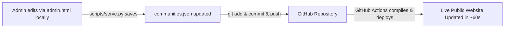

# 🚀 Pre-Release Deployment Guide — Real-World Testing

This guide details how to publish and host the **Satyaseva Sisters Web Portal** on Git (GitHub Pages, Cloudflare Pages, or Netlify) for real-world pre-release testing on mobile devices, tablets, and desktops.

---

## 🏗️ Architecture: How Does the Site Run on Git?

A common question is: **"How will `serve.py` start when hosted on Git?"**

### The Answer: Zero Server Needed in Production!
* **GitHub Pages is a Static Edge CDN**: It delivers high-speed pre-rendered HTML, CSS, JavaScript, images, and JSON directly to users' browsers worldwide.
* **No Python runtime is required on Git**: All public pages (`index.html`, `communities.html`, `community.html`, `map.html`, `memorial.html`, etc.) read directly from static JSON files ([`site/data/communities.json`](site/data/communities.json) and [`site/data/memorial.json`](site/data/memorial.json)) with embedded fallback scripts.
* **The site cannot crash, sleep, or run out of server memory**: It is 100% free, maintenance-free, and always fast.

### The Content Management Workflow (JAMstack / GitOps)


1. **Locally**: Run `python3 scripts/serve.py 8000` to manage communities, upload photos, or edit memorial records in `admin.html`.
2. **Push to Git**: `git commit -am "Update content" && git push`
3. **Auto-Deploy**: The GitHub Actions workflow in [`.github/workflows/deploy.yml`](.github/workflows/deploy.yml) automatically checks, compiles, and publishes the new data live within 60 seconds.

---

## ⚡ Method 1: GitHub Pages (Recommended & Free)

A ready-to-run GitHub Actions workflow has been configured in:
[`.github/workflows/deploy.yml`](.github/workflows/deploy.yml).

### Step 1: Initialize Git and Commit
In your terminal, navigate to the `sscs` directory and initialize your repository:

```bash
cd /home/jc/AB/fun/sscs

# Initialize git repository (if not already done)
git init

# Stage all files (excluding sensitive databases & backups via .gitignore)
git add .

# Commit build
git commit -m "feat: pre-release portal build for real-world testing"
```

### Step 2: Link and Push to GitHub
Create a new repository on [GitHub.com](https://github.com/new) (e.g. `sscs-portal` or `satyaseva-sisters`), then run:

```bash
# Ensure branch is named main
git branch -M main

# Link your remote repository (replace with your actual GitHub repository URL)
git remote add origin https://github.com/<your-username>/<your-repo-name>.git

# Push code to GitHub
git push -u origin main
```

### Step 3: Enable GitHub Pages via Actions
1. Open your repository on GitHub.
2. Click **Settings** (top navigation tab).
3. In the left sidebar, click **Pages** (under *Code and automation*).
4. Under **Build and deployment**:
   - Change **Source** from *"Deploy from a branch"* to **"GitHub Actions"**.
5. The deployment workflow will trigger automatically! Within 60 seconds, your site will be live at:
   ```
   https://<your-username>.github.io/<your-repo-name>/
   ```

---

## 🌐 Method 2: Cloudflare Pages (Fastest Global Edge CDN)

Cloudflare Pages provides world-class speed, automatic SSL, and native support for the security headers defined in [`site/_headers`](sscs/site/_headers).

1. Log in to the [Cloudflare Dashboard](https://dash.cloudflare.com/) and select **Workers & Pages**.
2. Click **Create Application** ➔ **Pages** ➔ **Connect to Git**.
3. Select your GitHub repository.
4. Configure the build settings:
   - **Framework preset**: `None`
   - **Build command**: *(leave blank)*
   - **Build output directory**: `site`
5. Click **Save and Deploy**. Your site will be live on a fast global edge URL like:
   ```
   https://sscs-preview.pages.dev
   ```

---

## ⚡ Method 3: Netlify (Instant Drag-and-Drop or Git)

If you prefer testing without connecting Git credentials:
1. Log in to [Netlify.com](https://app.netlify.com/).
2. Drag and drop the **`site/`** folder directly into the Netlify Drop box.
3. Your pre-release testing site goes live instantly with a shareable URL like:
   ```
   https://satyaseva-preview.netlify.app
   ```

---

## 📱 Real-World Pre-Release Testing Matrix

Share the pre-release link with sisters, council members, and beta testers on actual smartphones and laptops. Test the following core areas:

| Area | Test Objective | What to Verify |
| :--- | :--- | :--- |
| 📱 **Mobile Responsiveness** | Test on iPhone (Safari) and Android (Chrome) | Navigation hamburger menu opens cleanly; font sizes readable; no horizontal scrolling. |
| 🌓 **Dark Mode Toggle** | Click the 🌙 / ☀️ icon in the header | Site switches smoothly to dark navy theme; preference persists across reloads (`localStorage`). |
| 🗺️ **Interactive GIS Map** | Visit `map.html` on 4G/5G mobile connection | Leaflet pins load over HTTPS without certificate warnings; tapping a station opens details popup. |
| 💬 **WhatsApp Quick Connect** | Tap floating green WhatsApp icon (bottom right) | Directly opens WhatsApp chat addressed to the sisters' mission inquiries. |
| 📥 **PWA "Add to Home Screen"** | Tap browser menu ➔ *Add to Home Screen* | App installs with custom icon and launches in standalone full-screen window. |
| 🛡️ **Security & Privacy** | Verify `privacy.html` and `impressum.html` | Compliant with GDPR and German statutory disclosure (§ 5 DDG). |
| 📴 **Offline Service Worker** | Enable Airplane Mode after initial visit | Cached pages load from Service Worker cache (`sw.js`). |

---

## 📧 Handling Static Form Submissions in Real-World Testing

On Git static hosts, the local Python backend (`/api/`) is absent. For testing form submissions on live websites without running a dedicated server:

- **Option A: Formspree (Zero Code)**
  In `contact.html`, `prayers.html`, and `donate.html`, replace:
  ```javascript
  fetch('/api/contact', { ... })
  ```
  with your free [Formspree](https://formspree.io/) or [Web3Forms](https://web3forms.com/) endpoint:
  ```javascript
  fetch('https://formspree.io/f/YOUR_FORM_ID', { ... })
  ```
  Inquiries will immediately forward to the congregation's real inbox.

- **Option B: Full-Stack Cloud Host (Render / Railway / Fly.io)**
  If you wish to test the live SQLite admin dashboard in the cloud:
  - Deploy `scripts/serve.py` as a Python web service on [Render.com](https://render.com) (free tier).
  - Update `activeApiBase` in `site/js/admin.js` to point to your cloud server URL.

---

## 🏷️ Custom Domain Setup (When Ready for Production)

When pre-release testing is complete and the leadership approves the site for public launch under `satyaseva.org` or `satyasevasisters.org`:

1. In GitHub Pages: Add your custom domain under **Settings ➔ Pages ➔ Custom domain**.
2. In your DNS Provider (GoDaddy, Namecheap, Cloudflare):
   - Add a `CNAME` record pointing `www` to `<your-username>.github.io`.
   - Add `A` records pointing apex domain to GitHub Pages IPs:
     ```
     185.199.108.153
     185.199.109.153
     185.199.110.153
     185.199.111.153
     ```
3. Check **Enforce HTTPS** in GitHub Pages settings.
